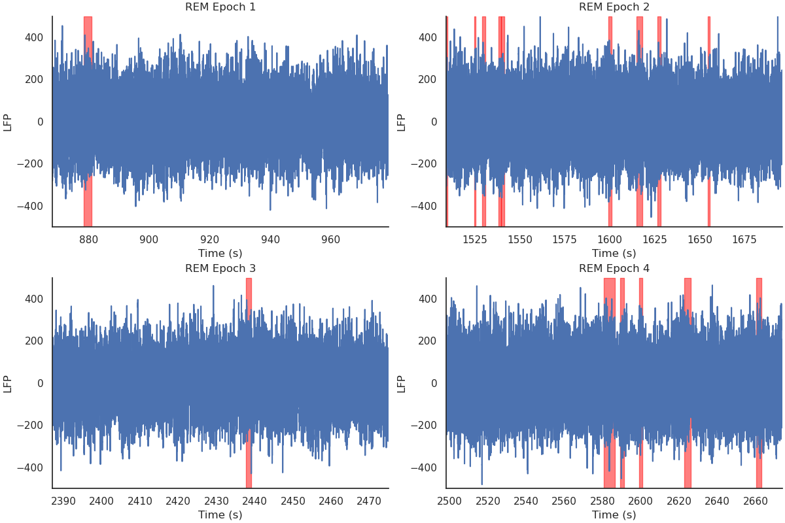

# Phasic-Tonic
[](https://badge.fury.io/py/phasic_tonic)
[](https://travis-ci.org/yourusername/phasic_tonic)
[](LICENSE)

## Overview

**phasic_tonic** is a Python package designed for the neuroscience community to analyze and detect phasic and tonic states during REM sleep from electrophysiological signals such as EEG or LFP data. The package implements a threshold-based signal processing algorithm specifically designed to identify these substates within REM sleep, which are important for understanding sleep-dependent processes, memory consolidation, and brain state modulation. 

This tool is useful for researchers working with sleep data and looking to classify REM sleep into more granular substates for further study.

<!--  -->
<p align="center">
  
</p>

## Key Features

- **Automatic Phasic/Tonic Detection**: Applies threshold-based algorithms to distinguish phasic and tonic states from raw electrophysiological data
- **Statistical Analysis**: Compute basic statistics for phasic/tonic REM periods.
  
## Installation

You can install **phasic_tonic** from PyPI using pip:
```bash
pip install phasic_tonic
```
or from the source code:
``` {.sourceCode .shell}
$ git clone https://github.com/8Nero/phasic_tonic.git
$ cd phasic_tonic
$ pip install -e .
```

## Quick Start

Here's a simple example of how to get started with phasic_tonic:

```py
import numpy as np
from phasic_tonic.analysis import PhasicTonic

# Load your LFP/EEG data and hypnogram
lfp_data_hpc = np.load('lfp_hpc.npy')
hypnogram = np.load('hypnogram.npy')

# Initialize the detector
pt = PhasicTonic(fs=1000)

# Detect phasic and tonic states
results = pt.detect(lfp_data_hpc, hypnogram)

# Analyze the results
summary = pt.compute_stats()
print(summary)
```
<!--  -->
<p align="center">
  
</p>

