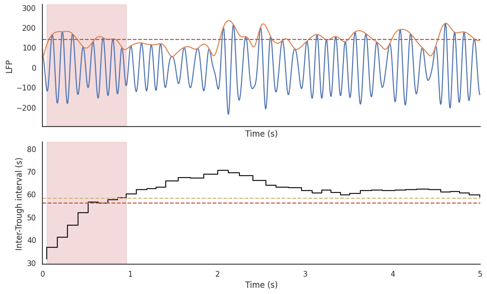

# Phasic-Tonic
[](https://badge.fury.io/py/phasic_tonic)
[](https://travis-ci.org/yourusername/phasic_tonic)
[](LICENSE)

## Overview

`phasic_tonic` is a python package for analysing phasic and tonic REM states from electrophysiological signals.
It implements a threshold-based signal processing algorithm for detecting phasic substates within REM sleep.

`phasic_tonic` is intended for researchers working with sleep data and looking to classify REM sleep into further substates.

## Examples

<!--  -->
<p align="center">
  
</p>

<!--  -->
<p align="center">
  
</p>

## Key Features

- **Phasic/Tonic Detection**: Applies threshold-based algorithms to distinguish phasic and tonic states from raw electrophysiological data
- **Statistical Analysis**: Compute basic statistics for phasic/tonic REM periods.

## Installation

Install with pip:
```bash
pip install phasic_tonic
```
or from the source code:
``` {.sourceCode .shell}
$ pip install git+https://github.com/8Nero/phasic_tonic.git
```

## Quick Start

Here's a simple example of how to get started with phasic_tonic:

```py
import pooch
import numpy as np
from phasic_tonic.detect import detect_phasic

f_path = pooch.retrieve("https://raw.githubusercontent.com/8Nero/phasic_tonic/main/data/ex01.npz", 
                        known_hash="11e579b9305859db9101ba3e227e2d9a72008423b3ffe2ad9a8fee1765236663")

data = np.load(f_path, allow_pickle=True)

hypnogram = data['hypnogram']
lfp = data['lfp_hpc']
fs = 500  # Sampling rate

phasicREM = detect_phasic(lfp, hypnogram, fs)
print(phasicREM)
```
