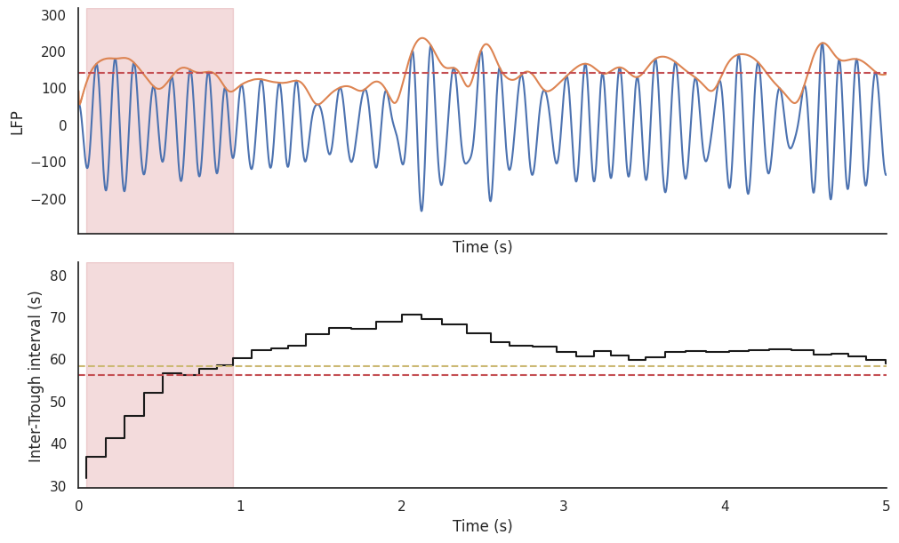
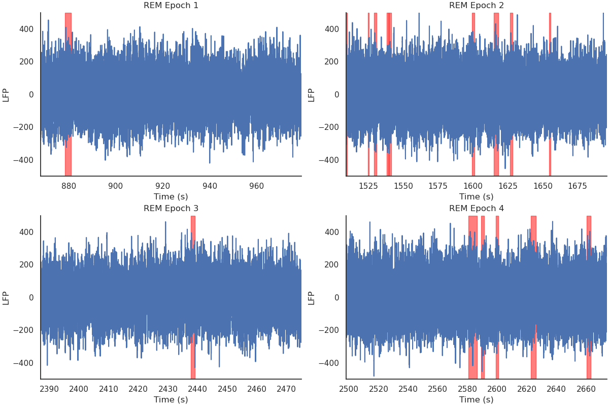

---
hide:
  - toc
---
# Phasic-Tonic
[](https://badge.fury.io/py/phasic_tonic)
[](https://travis-ci.org/yourusername/phasic_tonic)
[](LICENSE)

## Overview

`phasic_tonic` is a python package for analysing phasic and tonic REM states from electrophysiological signals. 
It implements a threshold-based signal processing algorithm for detecting phasic substates within REM sleep.
`phasic_tonic` is intended for researchers working with sleep data and looking to classify REM sleep into more granular substates for further study.
This package was developed by [Tuguldur Gerelmaa](https://github.com/8Nero) and [Abdel Rayan](https://github.com/AbdelRayan/) for phasic and tonic research in Genzel lab.

# <div style="text-align: center;">  </div>

# <div style="text-align: center;">  </div>

## Key Features

- **Phasic/Tonic Detection**: Applies threshold-based algorithms to distinguish phasic and tonic states from raw electrophysiological data
- **Statistical Analysis**: Compute basic statistics for phasic/tonic REM periods.

## Package dependencies

+ numpy
+ scipy
+ neurodsp
+ pynapple

## Quick Start

```py
from phasic_tonic.detect import detect_phasic

phasicREM = detect_phasic(signal  , hypnogram, fs)
```